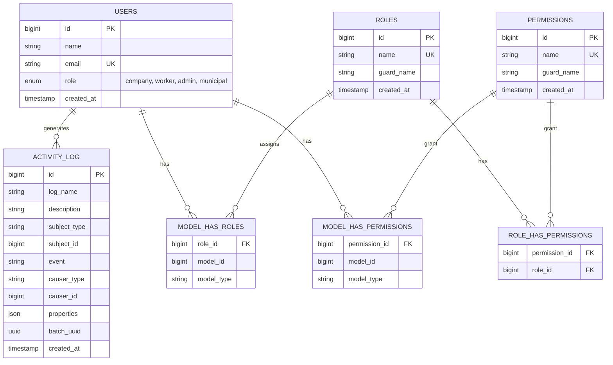
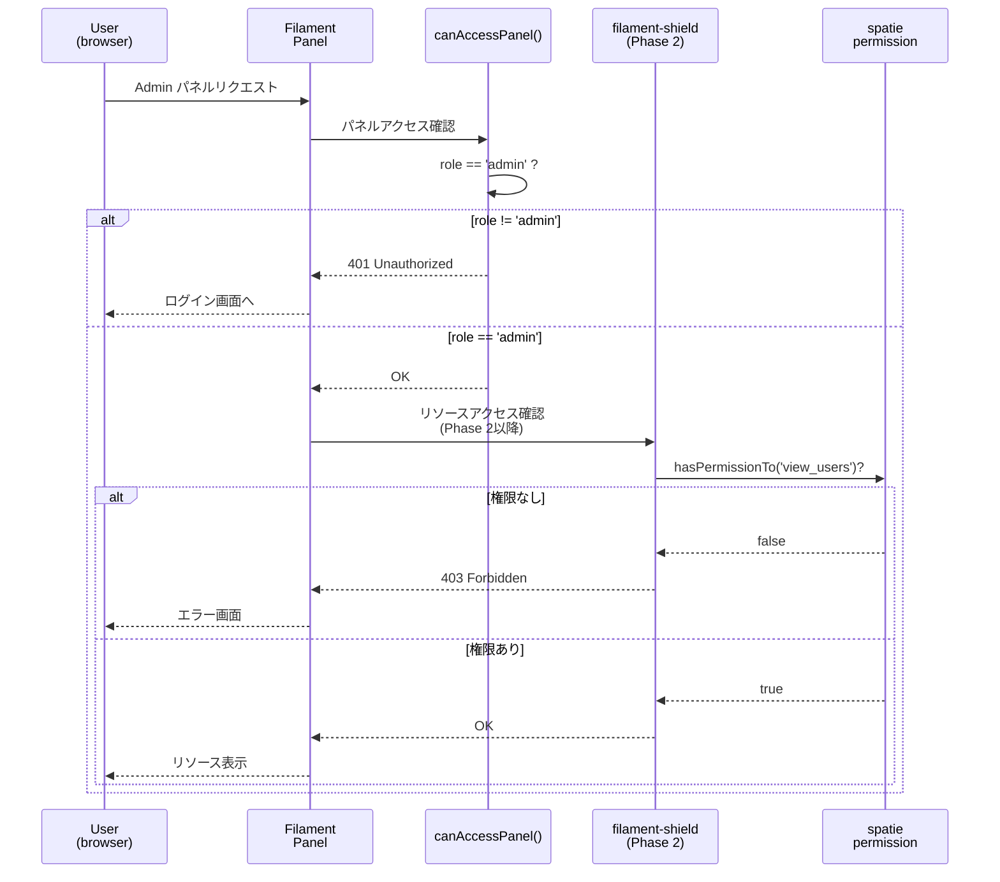
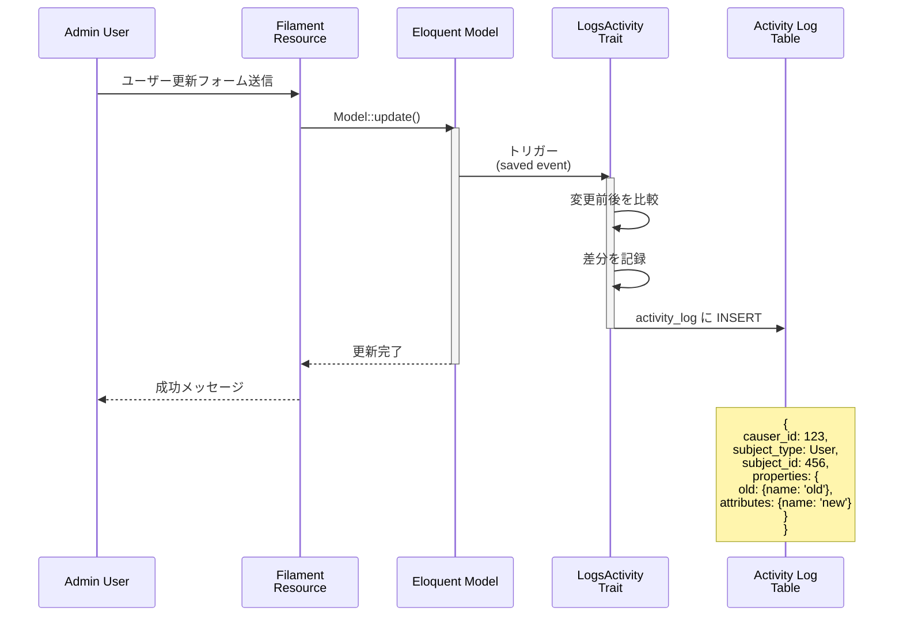
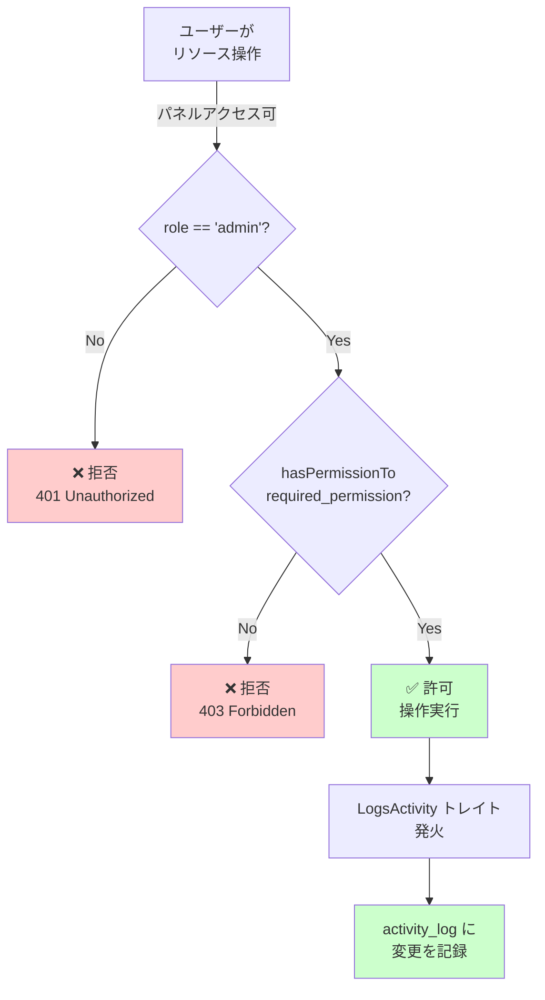

# ロール・権限・監査ログ設計

## 概要

本ドキュメントは、既存の User ロール enum システムに対して、リソース単位の細粒度権限管理と操作ログ（監査ログ）機能を段階的に導入するための設計書です。

**導入目標:**
- Admin パネル内での権限を管理職（ユーザー管理のみ可）と一般スタッフで分離
- 誰が、何を、いつ、どう変更したかを記録
- 本番環境での変更追跡と事故対応を可能に
- 既存ロール enum システムとの共存

**導入方針:**
- Phase 1: 操作ログ（優先度高、依存なし）
- Phase 2: 権限管理（権限設計完了後）

---

## 現状分析

### 既存システム

```
Laravel 12.53.0, PHP 8.3
Filament v4.8.1
User モデル: role enum (company, worker, admin, municipal)
```

### 現在のアクセス制御

```php
// canAccessPanel() で Admin / Government パネルを判定
public function canAccessPanel(Panel $panel): bool
{
    return match ($panel->getId()) {
        'admin'      => $this->role === 'admin',
        'government' => $this->role === 'municipal',
        default      => true,
    };
}
```

**問題点:**
- パネル内のリソース（ユーザー管理、求人管理など）に対して細粒度の権限がない
- 全 admin ユーザーは全リソースへのアクセス権を持つ
- 操作ログがないため、変更履歴が追跡不可

---

## 推奨構成

### 二層ロール設計

```
[第1層: パネルアクセス]
  ↓ 既存 users.role enum で判定
  └─ admin → Admin パネルアクセス OK
  └─ municipal → Government パネルアクセス OK
  └─ worker/company → 対象外

[第2層: リソース単位の権限]
  ↓ spatie/laravel-permission で判定
  └─ admin_super → 全リソース、全操作
  └─ admin_viewer → 参照のみ
  └─ user_manager → ユーザー管理のみ
  └─ municipal_viewer → Government パネルで参照のみ
```

### 使用パッケージ

#### Phase 1: 操作ログ

| パッケージ | バージョン | 用途 |
|-----------|-----------|------|
| `spatie/laravel-activitylog` | ^4.12 | 操作ログの自動記録 |
| `alizharb/filament-activity-log` | ^1.3 | 管理画面からログ閲覧 |

**対応状況:**
- PHP 8.3 ✓
- Laravel 12 ✓
- Filament v4 ✓

#### Phase 2: 権限管理

| パッケージ | バージョン | 用途 |
|-----------|-----------|------|
| `bezhansalleh/filament-shield` | ^4.1 | Filament 権限管理 UI |
| `spatie/laravel-permission` | ^6.24 | 権限・ロール機能（filament-shield の依存） |

**対応状況:**
- PHP 8.3 ✓
- Laravel 12 ✓
- Filament v4 ✓

**注意:** `spatie/laravel-permission` v7 は PHP ^8.4 が必須のため、v6 系を使用。

---

## データベース設計

### Phase 1: 操作ログテーブル

```
activity_log
├─ id (PK)
├─ log_name (string: 'default', 'admin', 'government')
├─ description (string: 'created', 'updated', 'deleted')
├─ subject_type (string: 'App\Models\User', 'App\Models\Job')
├─ subject_id (unsignedBigInteger)
├─ event (string: 'created', 'updated', 'deleted')
├─ causer_type (nullable string: 'App\Models\User')
├─ causer_id (nullable unsignedBigInteger)
├─ properties (json: {old: {...}, attributes: {...}})
├─ batch_uuid (nullable uuid)
├─ created_at (timestamp)
└─ updated_at (timestamp)

インデックス:
- (subject_type, subject_id)
- (causer_type, causer_id)
- created_at
```

### Phase 2: 権限管理テーブル

```
roles
├─ id (PK)
├─ name (string unique: 'admin_super', 'admin_viewer', etc)
├─ guard_name (string: 'web')
├─ created_at (timestamp)
└─ updated_at (timestamp)

permissions
├─ id (PK)
├─ name (string unique: 'view_users', 'create_users', etc)
├─ guard_name (string: 'web')
├─ created_at (timestamp)
└─ updated_at (timestamp)

model_has_roles
├─ role_id (FK: roles.id)
├─ model_id (unsignedBigInteger: users.id)
├─ model_type (string: 'App\Models\User')
└─ PK: (role_id, model_id, model_type)

model_has_permissions
├─ permission_id (FK: permissions.id)
├─ model_id (unsignedBigInteger: users.id)
├─ model_type (string: 'App\Models\User')
└─ PK: (permission_id, model_id, model_type)

role_has_permissions
├─ permission_id (FK: permissions.id)
├─ role_id (FK: roles.id)
└─ PK: (permission_id, role_id)

インデックス:
- (model_type, model_id)
```

### ER図



---

## フロー設計

### 認可フロー



### 操作ログ記録フロー



### 権限チェックフロー（Phase 2）



---

## 導入手順

### Phase 1: 操作ログ導入

#### 1. パッケージインストール

```bash
composer require spatie/laravel-activitylog:"^4.12"
composer require alizharb/filament-activity-log:"^1.3"
```

#### 2. マイグレーション公開・実行

```bash
php artisan vendor:publish --provider="Spatie\Activitylog\ActivitylogServiceProvider" --tag="activitylog-migrations"
php artisan migrate
```

#### 3. User モデルへトレイト追加

```php
<?php

namespace App\Models;

use Illuminate\Auth\Authenticatable;
use Illuminate\Database\Eloquent\Factories\HasFactory;
use Illuminate\Database\Eloquent\Model;
use Spatie\Activitylog\Traits\LogsActivity;
use Spatie\Activitylog\LogOptions;

class User extends Model
{
    use HasFactory, Authenticatable, LogsActivity;

    /**
     * ログ対象のカラムを指定
     */
    public function getActivitylogOptions(): LogOptions
    {
        return LogOptions::defaults()
            ->logOnly(['name', 'email', 'role'])
            ->logOnlyDirty()
            ->dontSubmitEmptyLogs();
    }

    // ...
}
```

#### 4. 監査対象モデルへトレイト追加

必要に応じて他のモデル（Job, Company など）にも `LogsActivity` トレイトを追加：

```php
class Job extends Model
{
    use HasFactory, LogsActivity;

    public function getActivitylogOptions(): LogOptions
    {
        return LogOptions::defaults()
            ->logOnly(['title', 'description', 'salary', 'status'])
            ->logOnlyDirty()
            ->dontSubmitEmptyLogs();
    }
}
```

#### 5. 設定ファイル確認

`config/activitylog.php` で以下を確認：

```php
'default' => env('ACTIVITY_LOGGER_DEFAULT', 'default'),

'table_name' => 'activity_log',

'database_connection' => env('ACTIVITY_LOGGER_CONNECTION', null),
```

#### 6. Admin Panel に プラグイン登録（Filament v4.8+）

`app/Providers/Filament/AdminPanelProvider.php`:

```php
use Alizharb\FilamentActivityLog\FilamentActivityLogPlugin;

class AdminPanelProvider extends PanelProvider
{
    public function panel(Panel $panel): Panel
    {
        return $panel
            ->id('admin')
            // ... 他の設定
            ->plugins([
                FilamentActivityLogPlugin::make(),
            ]);
    }
}
```

#### 7. 検証

```bash
php artisan tinker

# User を更新してログが記録されるか確認
$user = User::first();
$user->update(['name' => 'Updated Name']);

# ログ確認
DB::table('activity_log')->latest()->first();
```

Admin パネル内で「Activity」メニューからログ閲覧が可能になります。

---

### Phase 2: 権限管理導入（Phase 1 完了後）

#### 1. パッケージインストール

```bash
composer require bezhansalleh/filament-shield:"^4.1"
```

自動的に `spatie/laravel-permission` v6 がインストールされます。

#### 2. マイグレーション公開・実行

```bash
php artisan vendor:publish --provider="Spatie\Permission\PermissionServiceProvider"
php artisan migrate
```

#### 3. Shield セットアップ

```bash
php artisan shield:install
```

対話形式で以下を聞かれます：
- Generate permissions and roles for all Filament resources? → `yes`
- Update User model with Filament Shield trait? → `yes`
- Update User model with Spatie package trait? → `yes`

#### 4. User モデル確認

`app/Models/User.php` に自動的に追加される：

```php
use Spatie\Permission\Traits\HasRoles;

class User extends Model
{
    use HasFactory, HasRoles, LogsActivity;
    // ...
}
```

#### 5. Admin Panel に Shield プラグイン登録

`app/Providers/Filament/AdminPanelProvider.php`:

```php
use BezhanSalleh\FilamentShield\FilamentShieldPlugin;

class AdminPanelProvider extends PanelProvider
{
    public function panel(Panel $panel): Panel
    {
        return $panel
            ->id('admin')
            // ... 他の設定
            ->plugins([
                FilamentActivityLogPlugin::make(),
                FilamentShieldPlugin::make(),
            ]);
    }
}
```

#### 6. ロール・権限の生成

```bash
# Filament リソース全体のロール・権限を自動生成
php artisan shield:generate --all

# または、特定リソースのみ生成
php artisan shield:generate --resource=UserResource
```

これにより、以下が自動生成されます：
- ロール: `admin`, `editor` など
- 権限: `view_users`, `create_users`, `update_users`, `delete_users` など

#### 7. ロール設計（手作業）

Shield の自動生成後、ビジネス要件に合わせてロールをカスタマイズ：

```bash
php artisan tinker

# Role 一覧確認
Spatie\Permission\Models\Role::all();

# 新規ロール作成例
$role = Spatie\Permission\Models\Role::create(['name' => 'admin_super']);
$role = Spatie\Permission\Models\Role::create(['name' => 'admin_viewer']);
$role = Spatie\Permission\Models\Role::create(['name' => 'user_manager']);
$role = Spatie\Permission\Models\Role::create(['name' => 'municipal_viewer']);

# ロールへ権限を割当
$role = Spatie\Permission\Models\Role::findByName('admin_super');
$role->syncPermissions(Spatie\Permission\Models\Permission::all());

# ユーザーへロールを割当
$user = User::find(1);
$user->assignRole('admin_super');

# 権限確認
$user->hasPermissionTo('view_users'); // true
```

#### 8. リソースへの認可ポリシー設定

Filament v4.8+ では、Shield が自動的にポリシーを設定します。
必要に応じて `app/Policies/` カスタマイズ。

#### 9. 検証

```bash
php artisan tinker

$user = User::find(1);

# ロール確認
$user->roles; // ユーザーが持つロール

# 権限確認
$user->permissions; // 直接割当された権限
$user->hasPermissionTo('view_users'); // 権限チェック
$user->hasRole('admin_super'); // ロールチェック
```

---

## 既存ロール enum との共存

### 設計方針

**users.role enum は維持し、以下の役割分担:**

| 層 | カラム/機構 | 役割 | 設定方法 |
|---|----------|------|---------|
| 第1層 | `users.role` enum | パネルアクセス制御（大分類） | マイグレーション/Seeder |
| 第2層 | spatie roles/permissions | リソース単位の細粒度権限 | Shield UI または Tinker |

### 実装例

#### 1. 既存カラム維持

```php
// 既存の users テーブル
Schema::table('users', function (Blueprint $table) {
    // role enum カラムは削除しない
    // $table->enum('role', ['company', 'worker', 'admin', 'municipal']);
});
```

#### 2. canAccessPanel() メソッド維持

```php
// User モデル
public function canAccessPanel(Panel $panel): bool
{
    return match ($panel->getId()) {
        'admin'      => $this->role === 'admin',
        'government' => $this->role === 'municipal',
        default      => true,
    };
}
```

#### 3. ロール設計とユーザー割当

```php
// Seeder または Tinker で実行

use Spatie\Permission\Models\Role;

// role enum = 'admin' であるすべてのユーザーに対して
// spatie role 'admin_super' を割当（管理者）
$adminRole = Role::findByName('admin_super');
$adminUsers = User::where('role', 'admin')->get();
$adminUsers->each(fn($user) => $user->assignRole($adminRole));

// 特定のユーザーは 'user_manager' のみ
$userManagerRole = Role::findByName('user_manager');
$user = User::find(123);
$user->syncRoles(['user_manager']);
```

#### 4. コントローラー・ポリシーでの権限チェック

```php
// Admin パネル内でリソースアクセス時

// 第1層チェック（Filament 自動）
canAccessPanel('admin') → users.role === 'admin'

// 第2層チェック（Shield + Gate 自動）
authorize('view', User::class) → $user->hasPermissionTo('view_users')
```

---

## 懸念点と対策

### 1. PHP バージョン制約

**懸念:** `spatie/laravel-permission` v7 は PHP ^8.4 が必須

**対策:**
- v6.24.1 を採用（PHP 8.3 で動作確認済み）
- composer.json で明示的に制約: `spatie/laravel-permission:^6.24`

**確認コマンド:**
```bash
composer show spatie/laravel-permission
```

### 2. 二層ロール設計の複雑性

**懸念:** "users.role enum" と "spatie role" の役割分担が複雑になる

**対策:**
- ドキュメント（本設計書）で明確に役割を定義
- コード内に以下のコメントを必ず記載:

```php
/**
 * 第1層: パネルアクセス制御
 * users.role enum で決定
 * (company, worker, admin, municipal)
 */
public function canAccessPanel(Panel $panel): bool { ... }

/**
 * 第2層: リソース単位の権限
 * spatie/laravel-permission で決定
 * (admin_super, admin_viewer, user_manager, etc)
 */
public function hasPermissionTo($permission) { ... }
```

### 3. activity_log テーブルの肥大化

**懸念:** 大量の操作が記録されるとテーブルが肥大化

**対策:**
- 定期的なアーカイブ: 90日以上前のログを別テーブル/S3 に移行
- インデックス戦略: (subject_type, subject_id) と created_at にインデックス
- テーブルパーティション（必要に応じて）

**アーカイブスクリプト例:**
```bash
php artisan tinker

$archiveDate = now()->subDays(90);
$logs = Activity::where('created_at', '<', $archiveDate)->get();
// ... CSV/JSON 出力 ...
Activity::where('created_at', '<', $archiveDate)->delete();
```

### 4. filament-shield v4 の成熟度

**懸念:** Filament Shield v4 は比較的新しく、バグがある可能性

**対策:**
- 単体テストで権限チェック動作を検証
- フォールバック: `aiarmada/filament-permissions` (v2.x 系) への置き換え検討
- 問題発生時は GitHub Issues で報告

### 5. 既存データへの影響

**懸念:** マイグレーション実行で既存データが破損する

**対策:**
- 本番環境導入前に開発環境で十分なテスト
- 本番環境導入前にバックアップ取得
- Phase 1 と Phase 2 を分けることで段階的に導入

---

## 権限設計テンプレート

### Admin パネル

```
[ロール: admin_super]
└─ 全リソースの全操作
   ├─ Users: view, create, update, delete
   ├─ Jobs: view, create, update, delete
   └─ Companies: view, create, update, delete

[ロール: admin_viewer]
└─ 全リソースの参照のみ
   ├─ Users: view
   ├─ Jobs: view
   └─ Companies: view

[ロール: user_manager]
└─ ユーザー管理のみ
   └─ Users: view, create, update, delete

[ロール: job_manager]
└─ 求人管理のみ
   ├─ Jobs: view, create, update, delete
   └─ Companies: view
```

### Government パネル

```
[ロール: municipal_viewer]
└─ 参照のみ
   ├─ Submissions: view
   └─ Users: view
```

---

## セキュリティ考慮事項

### 操作ログ

- `properties` フィールドには変更前後の値が記録される → パスワードは `->logOnlyDirty()` で除外
- causer_id は user が削除された場合の考慮 → nullable に設定済み
- ログ閲覧権限も Shield で管理 → 'view_activity_log' 権限を追加

### 権限管理

- キャッシュ無効化: ロール/権限変更時に `cache:clear` を実行
- デフォルト拒否: 権限がなければ操作不可（設定済み）
- 監査: 権限変更自体も activity_log に記録される

---

## テスト戦略

### Phase 1: 操作ログテスト

```php
// tests/Feature/ActivityLogTest.php

public function test_user_update_is_logged()
{
    $user = User::factory()->create();
    $this->actingAs($user);

    User::first()->update(['name' => 'New Name']);

    $this->assertDatabaseHas('activity_log', [
        'subject_type' => User::class,
        'event'        => 'updated',
    ]);
}

public function test_deleted_items_are_logged()
{
    $job = Job::factory()->create();

    $job->delete();

    $this->assertDatabaseHas('activity_log', [
        'subject_type' => Job::class,
        'event'        => 'deleted',
    ]);
}
```

### Phase 2: 権限管理テスト

```php
// tests/Feature/PermissionTest.php

public function test_admin_super_can_view_users()
{
    $admin = User::factory()->create(['role' => 'admin']);
    $admin->assignRole('admin_super');

    $this->actingAs($admin)
        ->get('/admin/users')
        ->assertOk();
}

public function test_admin_viewer_cannot_delete_users()
{
    $admin = User::factory()->create(['role' => 'admin']);
    $admin->assignRole('admin_viewer');

    $user = User::factory()->create();

    $this->actingAs($admin)
        ->delete("/admin/users/{$user->id}")
        ->assertForbidden();
}

public function test_worker_cannot_access_admin_panel()
{
    $worker = User::factory()->create(['role' => 'worker']);

    $this->actingAs($worker)
        ->get('/admin')
        ->assertUnauthorized();
}
```

---

## ドキュメント更新予定

本設計書の以下の項目は、実装進捗に応じて更新予定：

- 【Phase 1 完了時】 操作ログの実装例・スクリーンショット
- 【Phase 2 完了時】 権限管理の実装例・スクリーンショット
- 【本番導入時】 デプロイ手順・運用手順

---

## 参考リンク

- [spatie/laravel-activitylog v4 ドキュメント](https://spatie.be/docs/laravel-activitylog/v4/introduction)
- [spatie/laravel-permission v6 ドキュメント](https://spatie.be/docs/laravel-permission/v6/introduction)
- [Filament Shield v4 ドキュメント](https://filamentphp.com/plugins/bezhansalleh-shield)
- [alizharb/filament-activity-log](https://github.com/alizharb/filament-activity-log)
